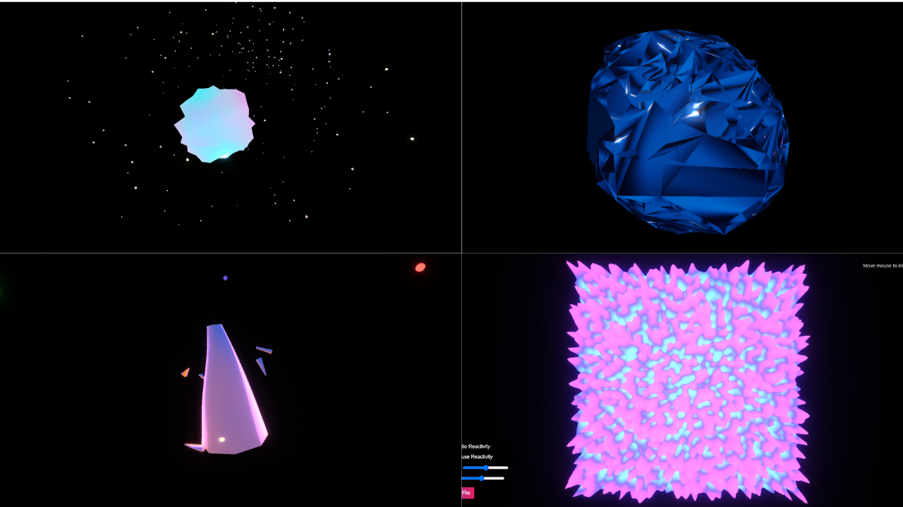

# Morphing Neon Blob

A Three.js visualization featuring a smooth morphing 3D blob with neon gradient colors that shift dynamically. The shape floats in space with soft lighting effects and small glowing particles orbiting around it.

## Features

- **Morphing Blob**: A smooth, continuously morphing 3D shape using simplex noise
- **Dynamic Neon Gradients**: Beautiful color transitions that shift over time
- **Orbiting Particles**: Small glowing particles orbit around the central blob in random paths
- **Glow Effects**: Bloom post-processing for that perfect neon glow
- **Interactive Controls**: Orbit controls to navigate around the 3D scene

## Technologies Used

- Three.js for 3D rendering
- GLSL shaders for advanced visual effects
- JavaScript for animation and interactivity

## How to Run

1. Clone or download this repository
2. Open the project directory in your terminal
3. Serve the project using a local web server. For example:
   - With Node.js: `npx serve` (requires Node.js installed)
   - With Python: `python -m http.server` (Python 3) or `python -m SimpleHTTPServer` (Python 2)
4. Open your browser and navigate to the local server address (typically http://localhost:8000 or similar)

## Controls

- **Left-click + drag**: Rotate the camera around the blob
- **Right-click + drag**: Pan the camera
- **Scroll**: Zoom in/out

## Customization

You can customize the visualization by modifying parameters in the JavaScript code:

- Adjust blob morphing speed and intensity in the `createBlob()` function
- Change particle count, size, and orbit properties in the `createParticles()` function
- Modify the color palette in the fragment shader
- Adjust bloom effect parameters in the `setupPostProcessing()` function

## License

MIT

## Credits

Created with Three.js - https://threejs.org/ 