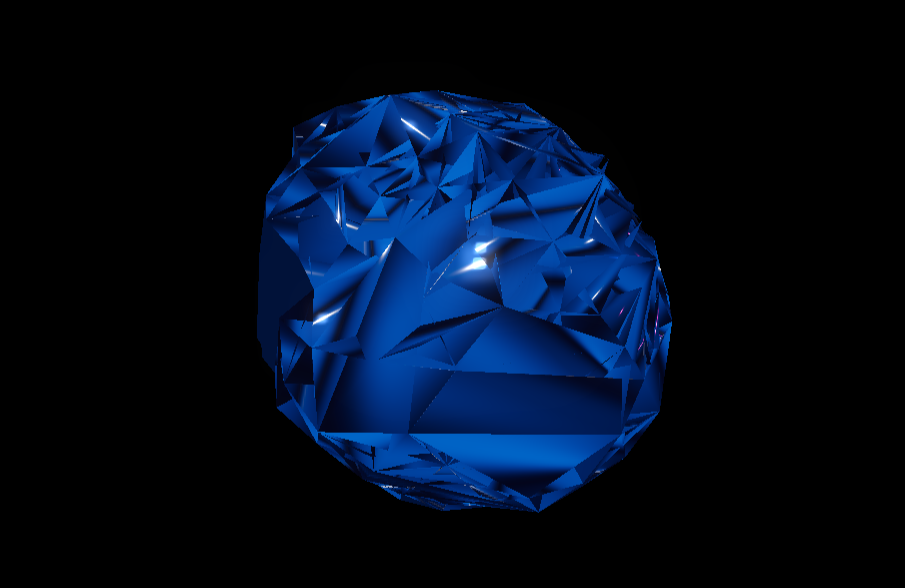

# Liquid Metal Morph

A Three.js visualization featuring a 3D liquid metal shape that constantly transforms between different abstract forms. The surface is highly reflective, resembling mercury, and shifts seamlessly between shapes.

## Features

- **Liquid Metal Surface**: Highly reflective material that mimics the appearance of mercury
- **Shape Morphing**: Smooth transitions between different 3D shapes (sphere, cube, torus, etc.)
- **Dynamic Fluidity**: Constant surface perturbations that create a liquid-like effect
- **Multiple Metal Types**: Options to change between mercury, gold, copper, chrome, and iridescent
- **Environmental Reflections**: Realistic reflections that enhance the metallic appearance

## Technologies Used

- Three.js for 3D rendering
- Custom shape morphing system for smooth transitions
- Advanced material properties for realistic metal surfaces
- Post-processing effects for enhanced visual quality

## How to Run

1. Open the `liquid-metal-morph.html` file in your browser (requires a local server)
2. Alternatively, serve the project using a local web server. For example:
   - With Node.js: `npx serve` (requires Node.js installed)
   - With Python: `python -m http.server` (Python 3) or `python -m SimpleHTTPServer` (Python 2)
3. Open your browser and navigate to the local server address (typically http://localhost:8000 or similar)

## Controls

- **Auto Morph**: Toggle automatic shape morphing on/off
- **Morph Speed**: Adjust how quickly the shape transforms
- **Surface Turbulence**: Control the intensity of the liquid-like surface movements
- **Shape Selection**: Choose a specific shape or allow random morphing
- **Metal Color**: Change the metal type (mercury, gold, copper, chrome, iridescent)
- **Camera**: Click and drag to rotate the view, scroll to zoom

## Technical Implementation

The liquid metal effect is achieved through a combination of:

1. **Vertex Morphing**: Interpolating between different base geometries
2. **Noise Displacement**: Adding procedural noise to create liquid-like surface perturbations
3. **Physically Based Rendering**: Using accurate reflectivity, metalness, and roughness properties
4. **Environment Mapping**: Simulating realistic reflections from the surrounding environment
5. **Bloom Post-Processing**: Adding subtle glow to highlights for a more realistic metal appearance 