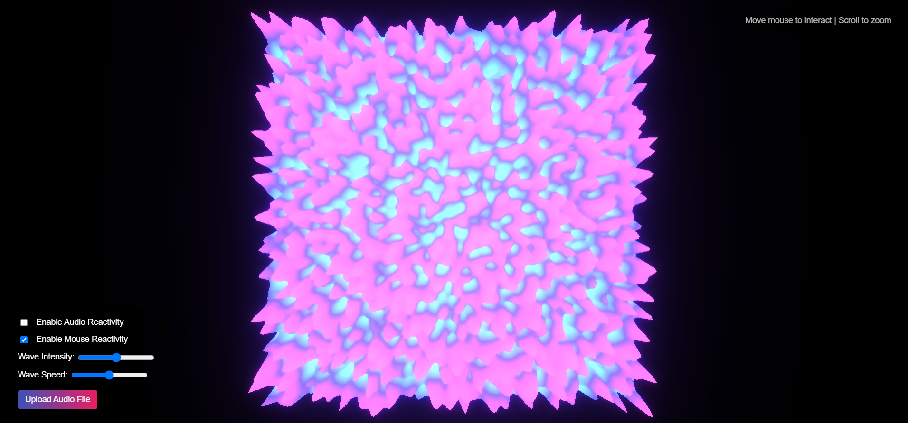

# Wave Visualizer

A Three.js visualization featuring smooth, flowing waves that react to music and mouse movement, with dynamic color transitions between blues, purples, and reds.

## Features

- **Interactive Wave Surface**: A fluid, organic surface that responds to mouse movement
- **Audio Reactivity**: Waves react to music or audio input, with upload functionality
- **Dynamic Color Shifts**: Smooth color transitions between blues, purples, and reds
- **Customizable Parameters**: Adjustable wave intensity, speed, and reactivity
- **Bloom Effects**: Subtle glow that enhances the wave visualization

## Technologies Used

- Three.js for 3D rendering
- Web Audio API for audio processing and visualization
- GLSL shaders for wave animations and color transitions
- Post-processing effects for enhanced visual quality

## How to Run

1. Open the `wave-visualizer.html` file in your browser (requires a local server)
2. Alternatively, serve the project using a local web server. For example:
   - With Node.js: `npx serve` (requires Node.js installed)
   - With Python: `python -m http.server` (Python 3) or `python -m SimpleHTTPServer` (Python 2)
3. Open your browser and navigate to the local server address (typically http://localhost:8000 or similar)

## Controls

- **Mouse Movement**: Move your mouse over the wave surface to create ripples
- **Left-click + drag**: Rotate the camera view
- **Scroll**: Zoom in/out
- **Wave Intensity**: Adjust the slider to change the amplitude of the waves
- **Wave Speed**: Control how fast the waves move
- **Audio Reactivity**: Toggle on/off to make the waves react to audio
- **Mouse Reactivity**: Toggle on/off to control mouse interaction
- **Upload Audio**: Click the button to upload your own audio file

## Customization

You can further customize the visualization by modifying parameters in the JavaScript code:

- Adjust the `params` object to change wave properties:
  - `size`, `resolution`: Change the wave surface dimensions and detail
  - `amplitude`, `frequency`, `noiseScale`: Modify wave behavior
  - `hueRange`, `saturation`, `lightness`: Adjust color palette
  - `bloomStrength`, `bloomRadius`, `bloomThreshold`: Fine-tune glow effects

## Audio Features

The visualizer can react to audio in two ways:
1. Upload an audio file using the button in the control panel
2. Enable audio reactivity to use your microphone (requires browser permission)

The wave surface will dynamically respond to different frequency ranges in the audio, creating a unique visual experience for each song. 